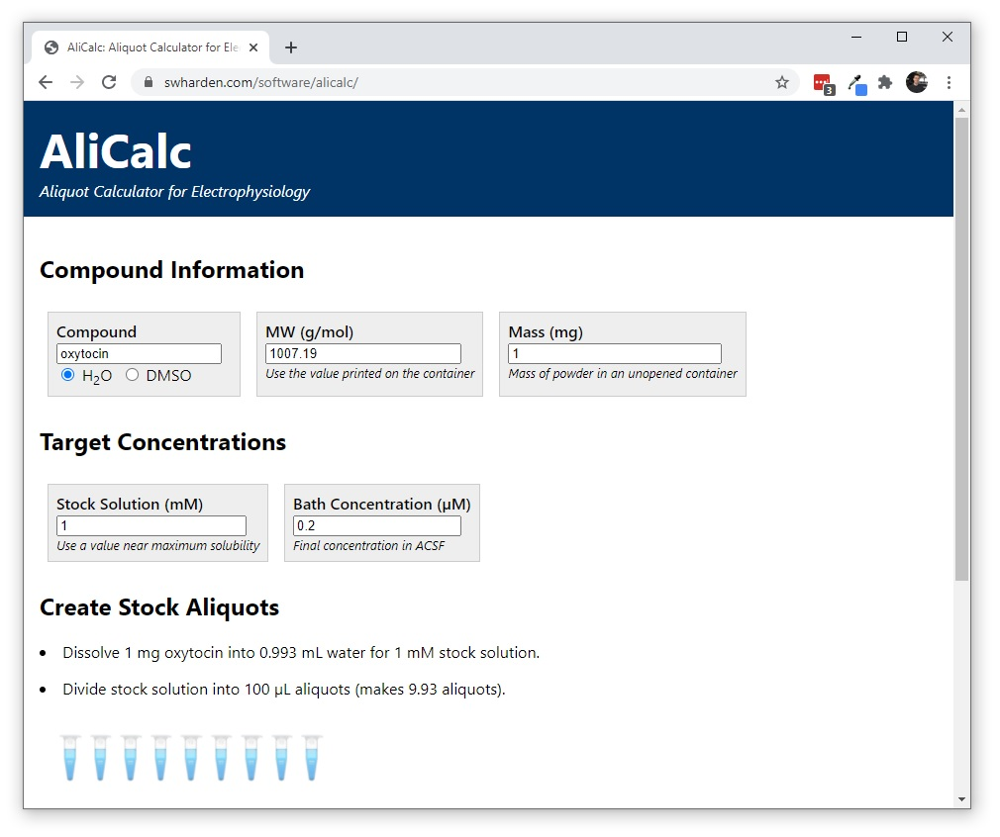

# AliCalc-JS

**AliCalc is an aliquot calculator for electrophysiology experiments.** This repository implements AliCalc as a progressive web application (PWA) using React (JavaScript).

> **⚠️ Update: AliCalcJS has been replaced by [AliCalc](https://github.com/swharden/AliCalc) (A .NET Blazor project)**

